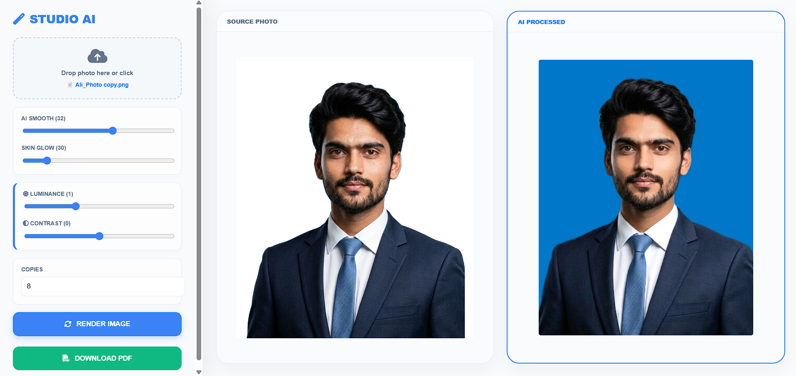
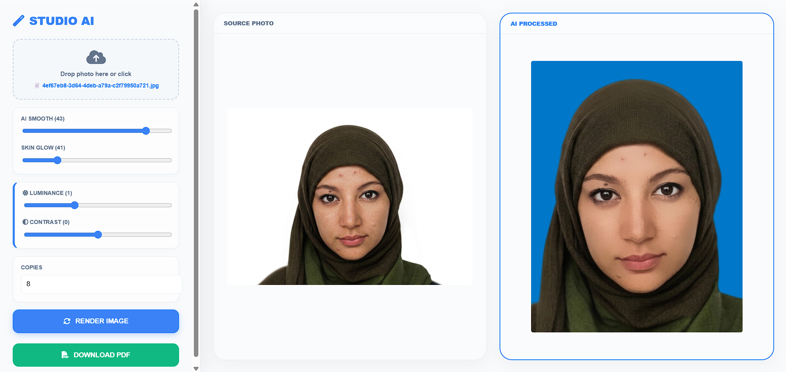
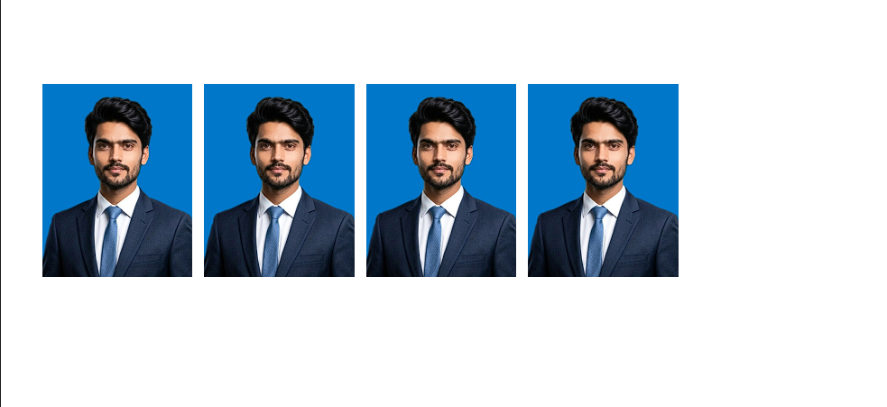
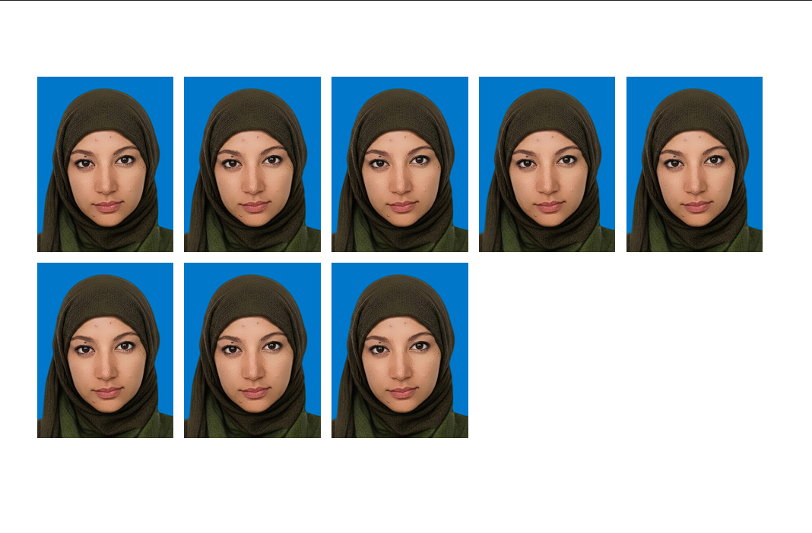

# AI-Powered Passport Photo Generator

A complete offline automation system for generating professional passport-size photos using AI-based background removal, smart retouching, and batch PDF export.

---

## 🚀 Introduction

This project is designed to automate the traditional workflow of photo studios where passport photos are manually edited, retouched, resized, and printed.

Instead of performing repetitive tasks, this system allows users to:

* Upload a single image
* Automatically remove the background
* Apply face retouching and enhancements
* Generate multiple passport-size photos
* Export all photos into a ready-to-print PDF

---

## 🎯 Why This Project?

* Saves time for photo studios
* Reduces manual editing effort
* Provides consistent and professional output
* Works completely offline (privacy-friendly)
* Automates a real-world business workflow

---

## 🧠 Key Features

* ✅ AI Background Removal (using rembg)
* ✅ Smart Face Retouching (skin smoothing + glow)
* ✅ Adjustable Brightness & Contrast
* ✅ Passport Size Auto Formatting
* ✅ Batch Photo Generation
* ✅ One-click PDF Export
* ✅ Clean and Modern UI
* ✅ Fully Offline Processing (No Internet Required)

---

## 🛠️ Tech Stack

### Frontend

* HTML5
* CSS3 (Glassmorphism UI)
* JavaScript (Vanilla JS)

### Backend

* Python
* Flask

### Libraries Used

* OpenCV (Image Processing)
* NumPy
* rembg (Background Removal AI)
* FPDF (PDF Generation)
* Flask-CORS

---

## 📸 Screenshots

### 🔹 Upload & Controls UI


### 🔹 AI Processed Output



### 🔹 PDF Output Preview




---

## ⚙️ How It Works

### Step 1: Upload Image

* User uploads a photo using the UI

### Step 2: Retouching

* Applies bilateral filtering for smooth skin
* Detects skin region using HSV masking
* Blends original + smooth image for natural results

### Step 3: Background Removal

* Uses AI model (rembg) to remove background

### Step 4: Passport Formatting

* Crops subject using alpha mask
* Resizes image to passport dimensions
* Places subject on standard background

### Step 5: Adjustments

* User can control:

  * Luminance
  * Contrast

### Step 6: PDF Generation

* User selects number of copies
* System arranges photos in grid layout
* Exports printable PDF

---

## 🧩 Project Structure

```
project-root/
│
├──  index.html
│
├── server.py
├── requirements.txt
└── README.md
```

---

## ▶️ How to Run

1. Clone the repository

```bash
git clone https://github.com/alisraza123/AI-Powered-Passport-Photo-Generator.git
```

2. Install dependencies

```bash
pip install -r requirements.txt
```

3. Run the server

```bash
python app.py
```

4. Open in browser

```
http://127.0.0.1:5000
```

## 💼 Use Cases

This system can be used in:

* 📷 Photo Studios
* 🏫 Schools (ID cards)
* 🏢 Offices (Employee IDs)
* 🧾 Government Documentation Centers
* 🛂 Passport & Visa Services

---

## 💡 Why It Is Useful

* Eliminates repetitive manual work
* Reduces human error
* Speeds up photo processing
* Ensures consistent output quality
* Protects user privacy (offline system)

---

## 🔮 Future Improvements

* Add multiple background options
* Face alignment detection
* Cloud-based version (SaaS)
* Drag-and-drop batch upload
* Mobile support

---

## 📄 License

This project is open-source and available under the MIT License.

---

## 🙌 Author

Developed by Ali Raza

---

## ⭐ Support

If you like this project, give it a star ⭐ on GitHub!
